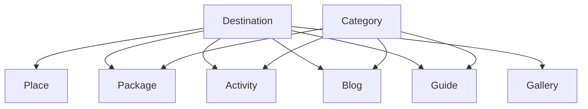

# Travel & Tourism Platform — Architecture & Requirements Audit

This doc is the Phase 1 architecture audit and Phase 2–10 blueprint for the Himachal travel platform, done before any code is written, as the brief requires. It follows the brief's own 10-phase order: audit first, then information architecture, database, application architecture, admin CMS, SEO, security, media, deployment, and a recommended build sequence. Read the audit section first — it flags a few requirements that need a decision before the schema below can be finalized.

## Phase 1 — Requirements audit

**Modules to merge.** Destinations, Places, and Things To Do overlap heavily — all three are "a location with a description, images, and best-time-to-visit." Keep them as three tables but on ONE shared content model (title, slug, body, images, SEO fields, geo point) with a `type` discriminator, rather than three independent schemas. This avoids duplicating the SEO/media/relationship logic three times and still lets each type carry its own extra fields (Places: opening hours; Activities: difficulty and price range). Travel Guides should not be a fourth content type — model it as a long-form Blog with `post_type = guide`, since the brief's own field list (rich content, images, destinations, places, FAQs, SEO) is identical to a blog post.

**Missing requirements.**
- No mention of multi-language/currency — confirm single-language (assume English, INR) for v1.
- No image storage target named — assumed S3-compatible object storage (Cloudflare R2 or AWS S3) since "do not store large originals in the app" is explicit; needs an account/bucket before build.
- No hosting/deployment target named — assumed Vercel (pairs naturally with Next.js) plus a managed Postgres (Neon/Supabase); confirm before Phase 10.
- No admin roles mentioned beyond "Admin" — assumed a single admin role for v1, with the schema left open for a `role` column so Editor/Super Admin can be added later without a migration.
- Enquiry module needs a notification path (email at minimum) or new leads will sit unseen in the admin panel — recommend adding email-on-new-enquiry via a transactional email provider (Resend/SES).
- "Nearby destinations" and "related" content need an explicit strategy: manual admin-picked relations (reliable, more admin work) vs. auto-computed by shared category/geo-proximity (less admin work, less predictable). Recommend manual picks with an auto-suggested default the admin can accept or override.

**Database relationship risk.** A naive schema would give Destination, Place, Package, Blog, and Activity each their own many-to-many join table to every other type (10+ join tables). Instead, use one polymorphic `content_relations` table (`from_type`, `from_id`, `to_type`, `to_id`, `relation_type`) — see Phase 3 — so "related content" logic and admin UI are written once, not five times.

**SEO risk.** Repeating SEO title/description/OG/keywords as columns on seven tables invites drift. Instead, model SEO metadata as one reusable embedded/JSON field shape used identically across Destination, Place, Package, Blog, Guide, and Activity, with sane auto-fallbacks (SEO title falls back to content title, OG image falls back to cover image) so an admin who fills nothing still gets valid tags.

**Admin UX risk.** Section 14's sidebar lists Destinations, Places, Packages, Blogs, Guides, Things To Do, and Categories as separate CMS sections — that's 6+ near-identical list/create/edit screens. Recommend one generic "Content module" list/form component (Phase 5) configured per content type, so the six modules share one implementation instead of six copies.

**Scalability check.** The brief's future-features list (hotels, bookings, reviews, vendor accounts) is compatible with the schema in Phase 3 as long as Package/Destination/Place are not hard-wired to assume "no price, no booking" — the schema below adds nullable `price`/`inventory`-shaped fields now so a future Booking module can attach without an ALTER touching every existing row.

**Performance check.** With images as the heaviest content and public pages meant to "stay fast as content grows," the two things that matter most are (1) list/detail pages generated statically with on-demand revalidation rather than SSR-per-request, and (2) database indexes on every slug and every foreign key used in a public query — both are specified in Phases 3–4.

**Security check.** No requirement conflicts with standard practice; Phase 7 covers it. One addition: rate-limit the public Enquiry/Contact forms specifically, since they're the one unauthenticated write path on an otherwise read-only public site.

## Phase 2 — Information architecture

**Public routes**

| Route | Purpose |
| --- | --- |
| `/` | Homepage (admin-configurable sections) |
| `/destinations` | Destination listing |
| `/destinations/[slug]` | Destination detail |
| `/places` | Places listing |
| `/places/[slug]` | Place detail |
| `/packages` | Package listing |
| `/packages/[slug]` | Package detail |
| `/things-to-do` | Activity listing |
| `/things-to-do/[slug]` | Activity detail |
| `/blog` | Blog listing |
| `/blog/category/[slug]` | Blog by category |
| `/blog/tag/[slug]` | Blog by tag |
| `/blog/[slug]` | Blog post |
| `/guides` | Travel guides listing |
| `/guides/[slug]` | Travel guide detail |
| `/gallery` | Gallery albums |
| `/gallery/[slug]` | Album detail |
| `/contact` | Contact page + form |
| `/sitemap.xml`, `/robots.txt` | Generated |

**Admin routes** (all under `/admin`, all behind auth middleware)

| Route | Purpose |
| --- | --- |
| `/admin/login` | Admin login (only unauthenticated route) |
| `/admin` | Dashboard |
| `/admin/destinations`, `/places`, `/packages`, `/blog`, `/guides`, `/activities` | List + create + `[id]/edit` per module |
| `/admin/categories` | Categories |
| `/admin/media` | Media library |
| `/admin/galleries` | Galleries/albums |
| `/admin/homepage` | Homepage section config |
| `/admin/navigation` | Nav builder |
| `/admin/footer`, `/faqs`, `/testimonials` | Website content |
| `/admin/enquiries` | Leads |
| `/admin/seo` | Global SEO defaults |
| `/admin/settings` | Profile, site settings, social links, contact info |

**Content hierarchy**



A destination page pulls its places, packages, activities, blogs, guides, and gallery through the shared `content_relations` table (Phase 3), so adding a new related type later needs no schema change to Destination itself.

## Phase 3 — Database schema

Relational (PostgreSQL). Shared shapes used across tables: `id uuid pk`, `created_at`, `updated_at`, `status enum(draft, published)`, and an embedded `seo jsonb` (`title, description, keywords, canonical_url, og_title, og_description, og_image_id, twitter_card, robots`).

| Table | Key fields | Notes |
| --- | --- | --- |
| `admins` | email (unique), password_hash, name, role, last_login_at | Single role for v1; column ready for future roles |
| `destinations` | name, slug (unique, indexed), short_description, description, cover_image_id, state, country, best_time_to_visit, weather jsonb, how_to_reach, travel_tips, seo | |
| `places` | name, slug (unique, indexed), description, destination_id (fk), lat, lng, opening_hours jsonb, best_time_to_visit, seo | |
| `activities` | name, slug (unique, indexed), description, destination_id (fk), duration, price_from, difficulty enum, best_season, safety_info, seo | "Things To Do" |
| `packages` | name, slug (unique, indexed), short_description, description, duration, price_from, destination_id (fk), included, excluded, highlights, faqs jsonb, seo | |
| `package_itineraries` | package_id (fk), day_number, title, description | Ordered by day_number |
| `blogs` | title, slug (unique, indexed), post_type enum(article, guide), body, excerpt, featured_image_id, author_id (fk admins), reading_time, published_at, seo | Travel Guides = post_type=guide |
| `blog_categories` | name, slug (unique) | |
| `blog_tags` | name, slug (unique) | |
| `blog_category_map`, `blog_tag_map` | blog_id, category_id/tag_id | Many-to-many |
| `categories` | name, slug (unique), applies_to enum(package, blog, activity) | Cross-cutting tag categories from section 9 |
| `galleries` | title, slug (unique), description | Albums |
| `gallery_images` | gallery_id (fk), media_id (fk), sort_order, is_featured | |
| `media` | url, alt_text, title, description, width, height, size_bytes, mime_type | Object-storage pointer, not the file itself |
| `content_relations` | from_type, from_id, to_type, to_id, relation_type enum(related, nearby) | Polymorphic — replaces per-pair join tables (indexed on (from_type, from_id)) |
| `faqs` | question, answer, context enum(global, package, destination, guide), context_id nullable | |
| `testimonials` | author_name, author_location, rating, quote, avatar_media_id, sort_order | |
| `enquiries` | name, email, phone, destination_id nullable, package_id nullable, travel_date, people_count, message, status enum(new, contacted, in_progress, converted, closed), admin_notes | |
| `navigation_items` | label, url, sort_order, parent_id nullable | Self-referencing for nesting |
| `website_settings` | key, value jsonb | Single-row key/value store: contact info, social links, homepage section toggles |

Indexes: unique index on every `slug`; btree index on every foreign key (`destination_id`, `package_id`, etc.); composite index on `content_relations(from_type, from_id)`; index on `enquiries(status, created_at)` for the admin list view. Constraints: `slug` unique per table; `status` and `role`/`relation_type`/etc. as Postgres enums, not free text, to keep the admin UI's filter dropdowns authoritative.

## Phase 4 — Next.js application architecture

**Folder structure** (App Router)

```
app/
  (public)/
    layout.tsx           # public header/footer
    page.tsx              # homepage
    destinations/[slug]/page.tsx
    places/[slug]/page.tsx
    packages/[slug]/page.tsx
    blog/[slug]/page.tsx
    ...
  admin/
    layout.tsx             # sidebar + auth guard
    (dashboard)/page.tsx
    destinations/page.tsx        # list
    destinations/[id]/page.tsx   # edit
    destinations/new/page.tsx
    ...
lib/
  db/                # Prisma client + queries per entity
  seo/               # metadata + structured-data builders
  media/             # upload + object-storage helpers
  auth/              # session/auth helpers
components/
  public/            # cards, hero, sections
  admin/             # generic ListPage, FormPage, Table, Filters
  shared/            # SEO head, image, pagination
```

**Server/client boundary.** Public pages are Server Components by default — they fetch directly from the database (via `lib/db`) and render HTML with no client JS beyond what's interactive (search box, gallery lightbox, mobile nav toggle), which are the only Client Components on those pages. Admin forms are Client Components (rich interactivity: image picker, drag-reorder, validation feedback) that call Server Actions for writes, so no separate REST/API layer is needed for CRUD — Server Actions double as the "API/data access strategy." A thin `app/api/` route group is added only for the sitemap, robots.txt, and any future public integrations.

**Data access.** One query module per entity in `lib/db` (e.g. `lib/db/destinations.ts` with `getBySlug`, `listPublished`, `create`, `update`) used by both public pages and admin Server Actions — single source of truth for queries, no duplicate SQL between the two surfaces.

**Caching/revalidation.** Public destination/place/package/blog/guide pages use `generateStaticParams` + Incremental Static Regeneration (`revalidate: 3600` or on-demand via `revalidatePath` triggered from the admin Server Action on publish/edit) — pages are pre-built and stay fast under load, and an admin edit shows up within the hour automatically or immediately via the explicit revalidate call. Listing pages with filters/pagination are dynamic (`force-dynamic` or short revalidate) since query params vary per request. Admin pages are always dynamic and never cached.

## Phase 5 — Admin CMS structure

Every content module (Destinations, Places, Packages, Blogs, Guides, Activities, Categories) is built once as a generic pattern, not six separate implementations:

- **`<ListPage config={moduleConfig}>`** — server-paginated table, column set from config, search box, status/category filters, bulk publish/unpublish/delete, "New" button.
- **`<FormPage config={moduleConfig} record?={record}>`** — one form renderer driven by a field-schema per module (text, rich text, image picker, relation picker, SEO panel, publish toggle), shared across create and edit.
- Every module gets the same actions for free: create, edit, delete (with a confirm dialog), publish/unpublish, and a live preview link to the public page when published.

Sidebar groups match the brief's section 14 exactly: Dashboard · Content (Destinations, Places, Packages, Blogs, Guides, Things To Do, Categories) · Media (Media Library, Galleries) · Website (Homepage, Navigation, Footer, FAQs, Testimonials) · Leads (Enquiries) · SEO (Global SEO, Sitemap settings) · Settings (Profile, Site Settings, Social Links, Contact Info).

The Dashboard reads counts (`published`, `draft`, `total`) per module plus the 5 most recent enquiries and 5 most recently edited content items — all cheap aggregate queries, no charting library needed.

## Phase 6 — SEO architecture

**Metadata model.** The shared `seo jsonb` field (Phase 3) feeds Next.js `generateMetadata()` on every content page, with fallback order: explicit SEO field → content's own title/description → site-wide default from `website_settings`. This guarantees no page ever ships empty meta tags even if an admin skips the SEO panel.

**Sitemap & robots.** `app/sitemap.ts` queries all published slugs across destinations, places, packages, blogs, guides, and activities and emits one `sitemap.xml` (paginated via sitemap index if the URL count grows past ~10k). `app/robots.ts` disallows `/admin` and any preview/draft routes, allows everything else, and points to the sitemap.

**Structured data per type:**

| Content | Schema.org type |
| --- | --- |
| Destination | `TouristDestination` |
| Place | `TouristAttraction` |
| Package | `Product` or `TouristTrip` |
| Blog / Guide | `Article` |
| Every page | `BreadcrumbList` |
| Every image | `ImageObject` |
| FAQ sections | `FAQPage` (only when real FAQ content exists on that page — never emitted on pages without one, to avoid invalid/misleading schema) |

Each is generated server-side from the same data already loaded for the page (no extra queries) and injected as a JSON-LD `<script>` tag via a shared `<StructuredData type=... data=... />` component.

## Phase 7 — Security & auth architecture

- **Auth:** credentials-based admin login (email + password) via NextAuth/Auth.js (or a hand-rolled session using `iron-session`), password hashed with bcrypt/argon2, session stored as an HTTP-only, `Secure`, `SameSite=strict` cookie. No public registration endpoint exists at all — admin accounts are seeded via a CLI script or created by an existing admin.
- **Route protection:** `middleware.ts` checks the session cookie on every `/admin/*` request (except `/admin/login`) and redirects unauthenticated requests; Server Actions that mutate data re-check the session server-side too, since middleware alone doesn't protect a directly-invoked Server Action.
- **Input validation:** every form and Server Action validated with a schema library (Zod) on the server, not just client-side, using the same schema for both so validation logic is defined once per module.
- **File upload safety:** uploads restricted to an image MIME allowlist, size-capped, re-encoded/stripped of EXIF on the server before storage, and served from object storage under a random key (never the original filename) to prevent path traversal or executable uploads.
- **Rate limiting:** the public Enquiry/Contact form and the admin login endpoint are rate-limited per IP (e.g. Upstash Redis or Vercel's edge rate limiting) — the two unauthenticated write paths.
- **CSRF/XSS:** Server Actions get Next.js's built-in CSRF protection; any rich-text content (blog body) is sanitized on render; no `dangerouslySetInnerHTML` without sanitization.
- **Secrets:** database URL, storage credentials, and session secret live in environment variables only, never referenced from client components, validated present at boot.

## Phase 8 — Media/image architecture

Originals are never stored in the app's own database or filesystem. Upload flow: admin picks a file → uploaded directly to object storage (Cloudflare R2 or AWS S3) via a signed upload URL generated by a Server Action → on success, a `media` row is written (url, alt text, dimensions, size) — the database only ever holds pointers and metadata. Public delivery goes through Next.js's built-in `<Image>` component (or a CDN image-resizing layer in front of the bucket) so every image is served resized, compressed, and lazy-loaded automatically, with the admin-entered alt text always required for save (empty alt text blocks publish, not just a warning) to keep image SEO and accessibility in place from day one. The Media Library admin screen is a searchable grid over the `media` table with a picker mode reused by every content form's image fields, so an image uploaded once for a blog post can be reused on a destination page without re-uploading.

## Phase 9 — Deployment & production readiness

- [ ] Environment variables set for production: `DATABASE_URL`, object storage keys, session secret, email provider key — none committed to the repo
- [ ] Managed Postgres provisioned (Neon/Supabase/RDS) with automated daily backups and point-in-time recovery enabled
- [ ] Prisma (or chosen ORM) migrations run as part of the deploy pipeline, never applied by hand in production
- [ ] App deployed to Vercel (or equivalent) with preview deployments per PR and a protected production branch
- [ ] Object storage bucket created with public-read on the media path only, admin-only write via signed URLs
- [ ] Error logging/monitoring wired (Sentry or equivalent) for both server and client errors
- [ ] Uptime/health check on `/api/health` hitting the database
- [ ] First admin account seeded via a one-time script, then that script disabled/removed
- [ ] `robots.txt` and `sitemap.xml` verified against the live domain before launch, and submitted to Google Search Console
- [ ] Load-test the homepage and one destination page to confirm ISR is actually serving cached pages under traffic, not regenerating per request

## Phase 10 — Recommended build order

1. **Foundation** — Next.js project, database schema (Phase 3), object storage, admin auth (Phase 7). Nothing else is buildable before these exist.
2. **Generic CMS pattern** — the shared `ListPage`/`FormPage` components (Phase 5), Media Library, and one real module (Destinations) built end-to-end through it to prove the pattern.
3. **Remaining content modules** — Places, Packages, Activities, Blog/Guides, Categories, Galleries — each fast to add once the pattern exists.
4. **Content relations & homepage CMS** — the `content_relations` picker UI, then homepage section configuration (Phase 16 of the brief).
5. **Public website** — all public pages consuming the now-populated CMS, built against real content rather than placeholders.
6. **SEO layer** — metadata, sitemap/robots, structured data (Phase 6) applied across the finished public pages.
7. **Leads & settings** — Enquiry system with email notification, Navigation builder, Website Settings, FAQs, Testimonials.
8. **Hardening & launch** — the Phase 9 checklist, performance pass, and a full run through the Phase 1 audit items to confirm each open decision was actually resolved.

Each step ships something demoable, and step 2 in particular is worth timeboxing carefully — getting the generic CMS pattern right is what keeps step 3 fast instead of repeating six times.
